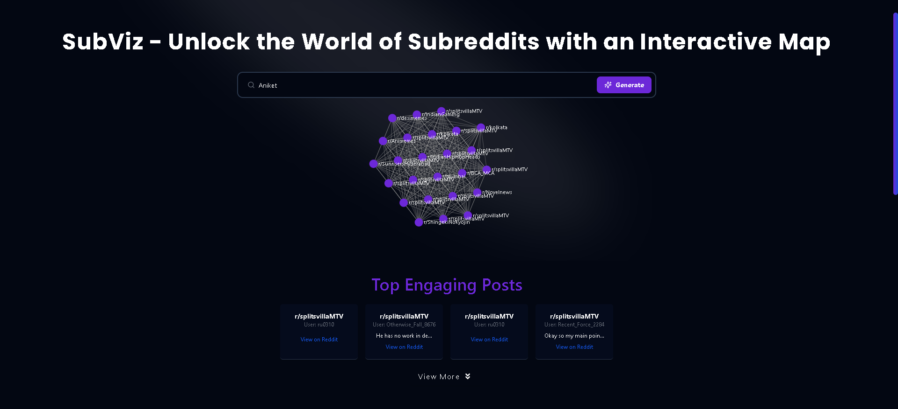

 [SubViz - on Product Hunt](https://subviz.prospectraai.com/)  
   *(Optional link, in case the previous one doesn't work: [https://subviz.netlify.app](https://subviz.netlify.app))*  
    
   
   

